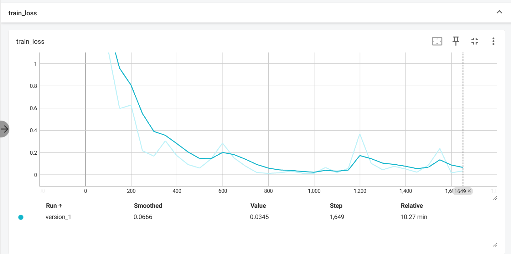
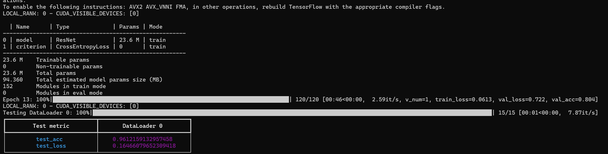
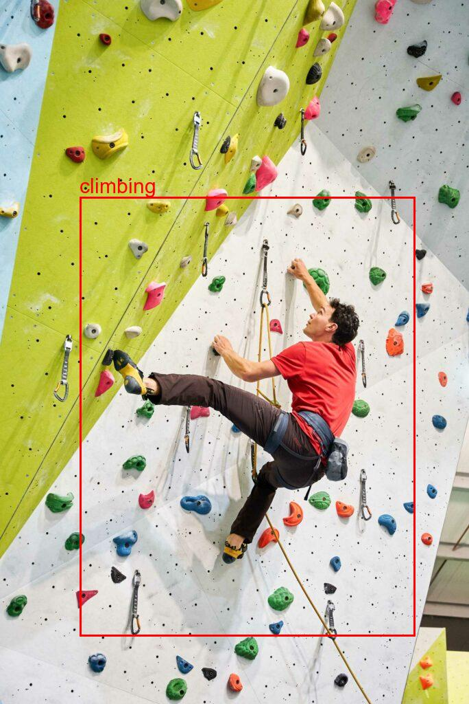
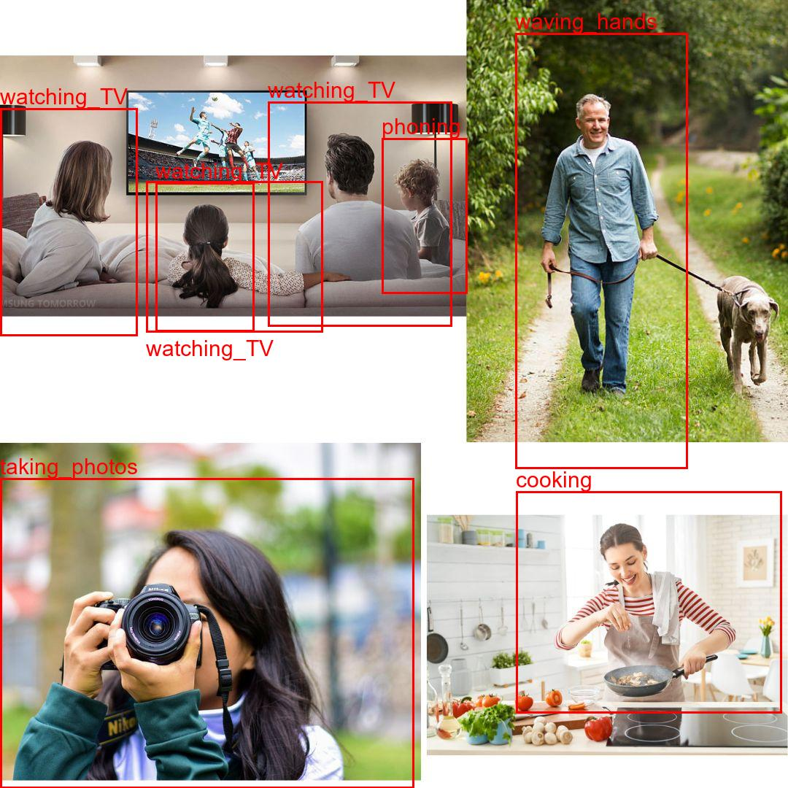
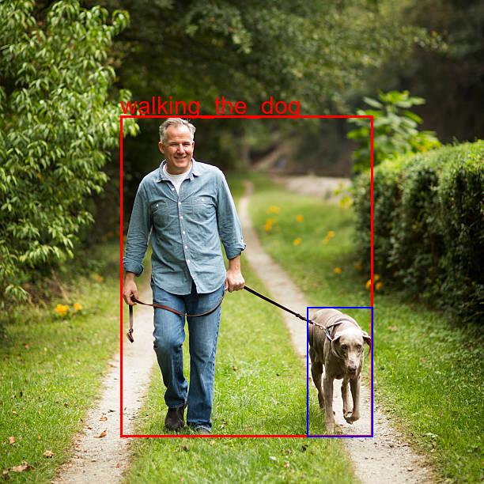
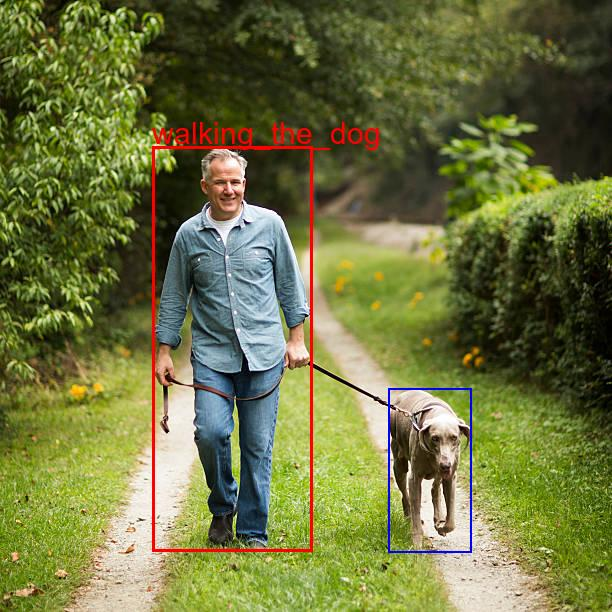

# 📌 Human Activity Recognition (HAR) with Pytorch Lightning Project

## 🔍 Introduction
This project focuses on recognizing human activities from images using deep learning. The model is based on **ResNet-50** with transfer learning to classify different human activities. Additionally, **YOLOv8** is used for object detection to improve accuracy by incorporating relevant context objects.

## 📂 Dataset
- **Structure:** The dataset is **Stanford40** and organized as `train/activity_name/xxx.jpg`.
- **Preprocessing:**
  - Images are resized to 224x224 before being fed into the ResNet model.
  - Normalization is applied using ImageNet mean and standard deviation.
  
## 🏗️ Pipeline
1. **Object Detection (YOLOv8):**
   - Detects people in images.
   - Optionally expands bounding boxes to include nearby objects.
2. **Activity Classification (ResNet-50):**
   - Cropped person images (with context) are passed to the HAR model.
   - The model predicts the activity label.
3. **Visualization & Output:**
   - Bounding boxes are drawn around detected objects.
   - Labels are displayed at optimal positions to avoid overlap.
   - Outputs are saved for analysis.

## ⚙️ Model & Training
- **Backbone:** ResNet-50 (pretrained on ImageNet, fine-tuned on HAR dataset)
- **Loss Function:** Cross-Entropy Loss
- **Optimizer:** Adam
- **Evaluation Metric:** Accuracy
- **Test Results:**
  - **Test Accuracy:** 96%
  - **Test Loss:** 0.13

## 📌 Performance
| Metric  | Value  |
|---------|--------|
| Test Accuracy | 96% |
| Test Loss | 0.13 |

### Train 



### Test 



## 🚀 How to Run
### Install Dependencies
```bash
pip install lightning ultralytics
```
### Train Resnet50
```bash
python HAR_main.py
```
### Run on a Single Image (only Resnet50)
```bash
python HAR_test.py climbing1
```
### Run on All Test Images (only Resnet50)
```bash
python HAR_test.py all
```
### Run on a Single Image (YOLOV8 + Resnet50)
```bash
python HAR_yolotest1.py climbing1
```
or 
```bash
python HAR_yolotest3.py climbing1
```
### Run on All Test Images (YOLOV8 + Resnet50)
```bash
python HAR_yolotest1.py all
```
or 
```bash
python HAR_yolotest3.py all
```

## 🖼️ Output Example
Here is an example of the output image:






## 🔬 Observations
- **Context Matters:** Expanding bounding boxes to include objects (e.g., a dog in "walking the dog") improves classification accuracy.
- **Bounding Box Refinement:** Large bounding boxes capture more context but may introduce noise. However, only increase the fixed proportion of bounding boxes may not capture all the context.
- **Optimal Label Placement:** Dynamic text positioning prevents label overlap for better readability.
- **Limitations:** Unable to working with multi-activities in one picture with the combination of YOLOv8 and Resnet50.

## 🔮 Future Improvements
- Implement a **temporal model** for video-based activity recognition.
- Fine-tune with a **larger dataset** for improved generalization.
- Experiment with **self-supervised learning** for feature extraction.
- New approach to work with multi-activities in one picture.

---
📌 **Developed as part of a deep learning project for human activity recognition.**

